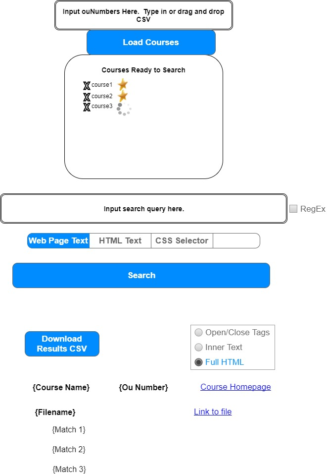

# D2l-Pages-Search


## Problem Description
At BYU-Idaho, teachers and employees need to find parts of courses that are either broken or need to be fixed in some way.  This program will allow the user to locate the problem the user is looking for and then simply provide a way to fix the problem.

## Design Overview

The program will search all of the courses in I-Learn using a library that Joshua McKinney wrote within the last month.  The program will be run from inside I-Learn, via an HTML page.  This will allow easy access for Joshua McKinney's library to quickly search the contents of any course.  The program will display the results to the user in a way that they understand and can easily navigate to and then fix the problem.  The user will be able to search by the actual text that the user can see on each course page, or by the CSS Selector, which would return all the occurrances of that selector in the course.

## Interface Design

The program will consist of a graphical user interface embedded in an HTML page in an I-Learn Course.  The interface will consist of two mechanisms for the user to input information, and two output mechanisms.

This is an example of how the UI will look like:



---
### User Input
Input | Description
----- | ------------------------
Ou Numbers | The Org Unit ID numbers of the courses the user wants to search
Search Query | What the user wants to search for

The following table describes what the program will do when the user makes certain actions:

Action | What will happen
------ | -----------------------
*Download Courses Button* is clicked | The program will download each of the course html pages of the specified courses to an array.<br><br>  As each course's files are being downloaded, its accompanying ou number is displayed in the *Courses Ready to Search* window.  A status icon appears to the right of each ou number.  While the course is being downloaded, a circular progress bar will appear to the right of its corresponding ou number.<br><br>  When a course has finished downloading, the circular progress bar will be replaced by a checkmark and the ou number will be replaced by the name of the course, signifying to the user completion and readiness to search that course.<br><br>  The *search button*, *search query input box* and *search options buttons* are only able to be interacted with after all the courses have finished downloading.
*Web Page Text* or *HTML Text* option button is clicked | A checkbox appears to the right of the *search query input box*, allowing the search to be done using a regular expression.
*CSS Selector* option button is clicked | The checkbox to the right of the *search query input box* disappears.
*Search* button is clicked | The program searches the downloaded courses for the given search query according to the selected search options.  When finished, the program displays the results below the search button.
*Download Results CSV* button is clicked | A CSV is generated of the data displayed to the user and is then downloaded.
*Course Homepage* link is clicked | The user is brought to the course's homepage.
*Link to File* link is clicked | The user is brought to content page where the file is located.
*CSS Selector Radio Buttons* are clicked | If the user has searched using a CSS Selector, then these buttons, when clicked, will change the format in which the results are displayed.  Further information is given in Output.

---
### Output
#### Match Output

If the user indicates to search using a CSS Selector, the three radio buttons seen above the results are displayed.  They indicate how the results are displayed, to better help the user analyze what they are looking for.  Examples of the output are given here:

Open/Close Tags: `<p class="recipe"></p>`<br>
Full HTML: `<p class="recipe">Beef Stroganoff: 1 Can Cream of Mushroom Soup</p>`<br>
Inner Text: `Beef Stroganoff: 1 Can Cream of Mushroom Soup`<br>

For a normal text search, the found match is given with 50 characters to the left of the beginning and 50 characters to the right of the match.  The match will be highlighted.  Example:

Search query: `'Hello Dolly!'`<br>
match: There once was a woman I knew who was very fair ```Hello Dolly!```  She was great.  She wore big hats and sang to me

#### CSV Output
For plain text or HTML searches:

courseName | ouNumber | pageUrl (with content/enforced/) | matchResult 
---------- | -------- | --------------------------------
| | | (50 characters left and right of the found word)

For CSS Selector searches:

courseName | ouNumber | pageUrl (with content/enforced/) | Open/Close Tags | Full HTML | Full Inner Text
--------- | -------- | -------------------------------- | --------------- | --------- | ------------
| | | `<div class="nameInputContainer"></div>` | `<div class="nameInputContainer">These are the contents of the div</div>` | These are the contents of the div
